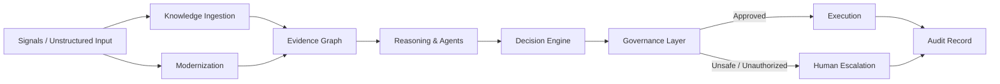

# Enterprise AI Decision Systems (EADS) — Research Companion

[](https://github.com/nirmaljingar/enterprise-ai-decision-systems/actions/workflows/tests.yml)
[](https://github.com/nirmaljingar/enterprise-ai-decision-systems/actions/workflows/docs.yml)
[](./LICENSE)
[](#status)
[](https://colab.research.google.com/github/nirmaljingar/enterprise-ai-decision-systems/blob/main/notebooks/eads_quickstart.ipynb)

A modular Python **research skeleton** for studying how reliable, safe, and auditable enterprise AI
decisions can be structured: a typed decision pipeline, a fail-closed governance layer, synthetic
data generators, and a benchmark harness. It is alpha software and not published to PyPI; several
modules are deliberate stubs (see [Status](#status) and
[`docs/limitations.md`](./docs/limitations.md)).

**Install and run in 60 seconds:**

```bash
pip install git+https://github.com/nirmaljingar/enterprise-ai-decision-systems.git
python -c "
from eads.core.pipeline import DecisionPipeline
from eads.core.types import DecisionRequest
from eads.decision.decision import DecisionEngine
from eads.governance import GovernanceLayer
from eads.synthetic_data import SupplyChainGenerator

request = DecisionRequest(
    request_id='demo',
    goal='decide replenishment order for SKU-1001',
    signals=SupplyChainGenerator(seed=42).generate(3),
    policy_snapshot={'region': 'US', 'unit_price': 10.0},
)
record = DecisionPipeline(governance=GovernanceLayer(), decision_engine=DecisionEngine()).run(request)
print('Outcome:', record.verdict.outcome)   # approved | rejected | escalated
print('Reason:', record.verdict.reason)
print('Execution:', record.execution.status)
print('Trace:', [t['step'] for t in record.trace])
"
```

A region is supplied in the policy snapshot because governance fails closed: an action whose
region it cannot establish is rejected rather than waved through.

## Live demo

- **60-second walkthrough:** [`docs/wow_demo.md`](./docs/wow_demo.md)
- **Killer Colab notebook:** [](https://colab.research.google.com/github/nirmaljingar/enterprise-ai-decision-systems/blob/main/notebooks/eads_killer_demo.ipynb)
- **Quickstart notebook:** [`notebooks/eads_quickstart.ipynb`](./notebooks/eads_quickstart.ipynb)

## Mission

The central research question this repository addresses is:

> How can enterprise AI systems remain **reliable, safe, and auditable** while delegating decision authority to autonomous LLM agents?

Enterprise AI is moving from deterministic rule engines to autonomous, language-model-powered agents. This transition creates a tension: the same models that can reason over unstructured data, modernize legacy systems, and coordinate multi-agent workflows are also probabilistic, opaque, and error-prone. The four IEEE EADS papers argue that the solution is not raw performance, but the disciplined integration of:

- **Probabilistic language models** for reasoning and planning.
- **Deterministic safety, policy, and optimization layers** for guarantees.
- **Human-visible audit and governance** for trust.

This repository becomes the official open companion to that research: it supplies the code, data, benchmarks, diagrams, and documentation necessary to study, clone, modify, and cite the work.

## The four IEEE papers

| Paper | DOI | Venue | Contribution in this repo |
|-------|-----|-------|---------------------------|
| Modernizing Legacy Enterprise Platforms Using LLM-Driven Refactoring and AI-Assisted Architecture Transformation | [10.1109/rmkmate69073.2026.11518954](https://doi.org/10.1109/rmkmate69073.2026.11518954) | RMKMATE 2026 | `eads.modernization` — legacy parsing, dependency extraction, monolith-to-microservice decomposition |
| Leveraging Large Language Models and Autonomous Agents for Unstructured Supply Chain Intelligence | [10.1109/icetsis68266.2026.11548779](https://doi.org/10.1109/icetsis68266.2026.11548779) | ICETSIS 2026 | `eads.knowledge_ingestion`, `eads.reasoning`, `eads.agents` — semantic extraction, evidence grounding, multi-agent collaboration |
| Reliable LLM-Powered Decision Engines for Large-Scale Supply Chain Operations: Architecture, Safety, and Performance Guarantees | [10.1109/IC_ASET69920.2026.11502212](https://doi.org/10.1109/IC_ASET69920.2026.11502212) | IC_ASET 2026 | `eads.decision`, `eads.governance.safety` — LLM decision engine, mathematical optimization, safety filtering |
| Operationalizing Generative and Agentic AI Across Complex Logistics Networks: Architecture, Governance, and Trust Models | [10.1109/icetsis68266.2026.11549394](https://doi.org/10.1109/icetsis68266.2026.11549394) | ICETSIS 2026 | `eads.governance` — policy, permissions, fallback, audit, and trust scoring |

Every DOI above resolves through Crossref to the title and venue listed, and
`tests/test_citations.py` re-checks that on every run — see [`CITING.md`](./CITING.md) for the full
IEEE citations and [`docs/research_design.md`](./docs/research_design.md) for the research design.

## Why this repository matters

- **Open and citable.** Released as a public research artifact under Apache-2.0 with `CITATION.cff`, `CITING.md`, and `LICENSE`.
- **Domain-agnostic.** Supply chain is the primary worked example, but the architecture is reusable for healthcare, finance, IT operations, customer support, and other domains.
- **Reproducible.** All examples use synthetic data and fixed seeds. With a fixed clock (`eads.core.clock.FixedClock`) and a seed-honoring backend, the same input, seed, and policy snapshot produce a byte-identical `AuditRecord`.
- **Transparent.** Every module, metric, and example either traces to an IEEE paper or is explicitly labeled as a *Reference implementation*, *Educational example*, or *Suggested extension*.
- **Vendor-neutral.** The core implementation uses only the Python standard library. Optional adapters for LLM backends, solvers, and forecasters are isolated so the architecture stays portable.

## Reference architecture



The decision lifecycle is: **Sense / Ingest → Modernize / Extract → Reason / Plan → Generate → Govern / Validate → Escalate or Execute → Audit.**

## Module map

| Module | Traced to | Responsibility |
|--------|-----------|--------------|
| `eads.core` | Reference implementation | Shared data model, pipeline contract, and plugin interface |
| `eads.modernization` | Paper 1 | *Stub:* import/counting heuristics over legacy source, not a refactoring engine |
| `eads.knowledge_ingestion` | Paper 2 | Lexical claim extraction with source spans, corroboration, and derived confidence |
| `eads.reasoning` | Papers 2, 3 | Multi-hop selection over the evidence graph, with contradiction reporting |
| `eads.agents` | Papers 2, 4 | *Stub:* message-passing primitives; no autonomous collaboration |
| `eads.decision` | Paper 3 | LLM + optimization + forecasting + safety filter |
| `eads.governance` | Papers 1, 3, 4 | Policy, safety, permissions, fallback, audit, and trust |
| `eads.evaluation` | Papers 1–4 | Reproducible benchmark harness and metrics |
| `eads.synthetic_data` | All | Domain-agnostic synthetic data generators |
| `examples/` | All | End-to-end educational workflows |
| `docs/` | All | Research design, architecture, tutorials, and limitations |

## Quick start

```bash
# Install the core package and development dependencies
pip install -e ".[dev]"

# Run the end-to-end quickstart with synthetic data (no API key required)
python examples/quickstart.py

# Run the test suite and reproducibility checks
pytest
```

## Installation

```bash
pip install -e .
```

Optional adapters are available as extras and remain isolated from the core:

```bash
pip install -e ".[openai]"     # OpenAI LLM backend
pip install -e ".[anthropic]"  # Anthropic LLM backend
pip install -e ".[solvers]"    # scipy, pulp, ortools, sktime adapters
pip install -e ".[pdf]"       # PyMuPDF paper extraction backend
pip install -e ".[docs]"       # mkdocs-material for building the documentation site
```

## Examples

```bash
python examples/quickstart.py                  # 60-second pipeline demo
python examples/supply_chain.py                # supply-chain replenishment benchmark
python examples/healthcare.py                   # healthcare triage/capacity benchmark
python examples/finance.py                      # finance compliance benchmark
python examples/it_operations.py                # IT incident response benchmark
python examples/customer_support.py             # support ticket prioritization benchmark
```

## Core data objects

The `eads.core.types` module defines the shared data model:

- `Signal` — a raw enterprise input.
- `Evidence` — a structured, source-annotated fact.
- `AgentMessage` — typed agent-to-agent messages.
- `DecisionCandidate` — a proposed action.
- `Verdict` — the result of policy, safety, and permission checks.
- `ProposedAction` — a parsed, checkable model proposal (`parsed=False` means governance rejects it).
- `ExecutionResult` — tool invocation output.
- `AuditRecord` — an append-only trace of a complete decision cycle.

## Evaluation metrics

The `eads.evaluation` module implements the reproducible metrics from the research design:

| Metric | Paper trace | Implemented |
|--------|-------------|-------------|
| `approval_rate` | — | Yes (throughput, not correctness) |
| `policy_compliance` | Papers 3, 4 | Yes — expected vs actual outcome on labelled scenarios |
| `decision_consistency` | Paper 3 | Yes — agreement across `repeats` runs of one scenario |
| `evidence_grounding_rate` | Paper 2 | Yes — fraction of evidence references that resolve |
| `fallback_recovery_rate` | Papers 3, 4 | Yes — injected violations actually withheld |
| `audit_completeness` | Paper 4 | Yes — required trace fields present |
| Tool Invocation Precision | Paper 3 | No — suggested extension |
| Decision Latency | Paper 3 | No — suggested extension |
| Token Efficiency | Papers 1–3 | No — suggested extension |

No numerical results or experimental claims are fabricated. Benchmarks live in `benchmarks/` and produce versioned `results.json` files.

## Reproducibility

- Timestamps come from an injectable clock, so `DecisionPipeline(clock=FixedClock())` plus fixed
  generator seeds make two runs of one request produce identical `AuditRecord` values
  (`tests/test_reproducibility.py` asserts this).
- `LLMBackend.supports_seed` declares whether a backend can honor a seed; the pipeline records it
  on the trace, so a run against a backend without seed support is not mistaken for a
  reproducible one. The Anthropic API exposes no seed parameter.
- Residual non-determinism is measured by `decision_consistency` over repeated runs rather than
  assumed away.
- Prompt, completion, and token logging is **not** implemented.

## Citation

Please cite both the originating IEEE papers and this repository. See [`CITATION.cff`](./CITATION.cff) for repository metadata and [`CITING.md`](./CITING.md) for the paper list and BibTeX guidance.

## License

This project is released under the [Apache-2.0 license](./LICENSE).

## Status

This repository is **alpha research software**, not a production framework and not a numerical
reproduction of the papers. What is actually implemented:

- End to end: the typed pipeline (ingest → modernize → reason → decide → govern → execute → audit),
  the fail-closed governance layer (policy, safety, permissions, escalation, fallback, audit,
  trust), reproducible records under a fixed clock, synthetic generators, and the benchmark harness
  with six metrics.
- Stubs, despite tracing to a paper: `eads.modernization`, `eads.agents`, and `TrustScorer` use
  counting or copying heuristics rather than the algorithms the papers describe. Each says so in its
  docstring.
- `eads.knowledge_ingestion` and `eads.reasoning` are implemented, but lexically: claims carry source
  spans and derived confidence, and planning walks a graph whose edges are shared entities and
  matching figures. Neither does coreference, negation scope, or entity linking.
- Not present: prompt/token logging, tool-invocation and latency metrics, a Zenodo DOI, a PyPI
  release, and any experimental result from the papers. The published benchmark numbers are
  illustrative runs of this implementation, not paper results.

Remaining work is tracked in [`docs/roadmap.md`](./docs/roadmap.md) and
[`docs/limitations.md`](./docs/limitations.md).
