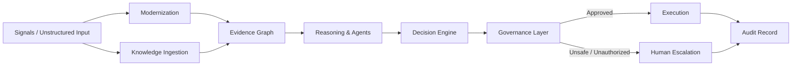

# Architecture

The EADS architecture demonstrates how to combine probabilistic language models with deterministic control layers. It is a reference arrangement of the four IEEE EADS papers, not a production framework.

## Layered reference architecture

## Decision lifecycle

1. **Sense / Ingest** — collect structured and unstructured inputs.
2. **Modernize / Extract** — parse legacy artifacts and extract semantic evidence.
3. **Reason / Plan** — agents collaborate to build candidate plans and evidence.
4. **Generate** — the decision engine produces candidate decisions.
5. **Govern / Validate** — policy, safety, and permission checks run together.
6. **Escalate or Execute** — fallback routes unsafe or unauthorized decisions to humans; otherwise tool invocation proceeds.
7. **Audit** — immutable log of inputs, evidence, decisions, rationale, and trust scores.

## Layer-to-paper mapping

| Layer | Paper | Responsibility |
|-------|-------|--------------|
| Modernization | 1 | Legacy parsing, dependency extraction, monolith-to-microservice decomposition |
| Knowledge Ingestion | 2 | Unstructured enterprise text to grounded evidence |
| Reasoning & Agents | 2, 4 | Multi-agent collaboration, evidence-based planning, hallucination mitigation |
| Decision Engine | 3 | LLM + optimization + forecasting + safety filter |
| Governance | 1, 3, 4 | Policy, safety, permissions, fallback, audit, trust |
